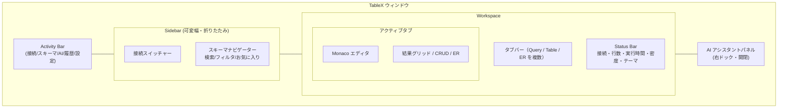
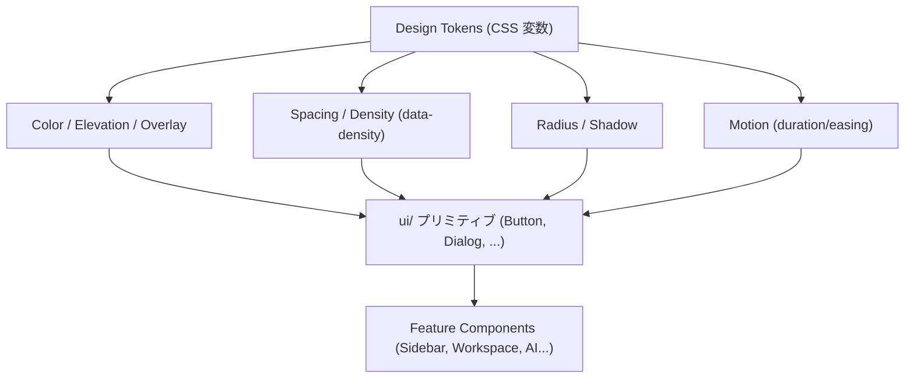
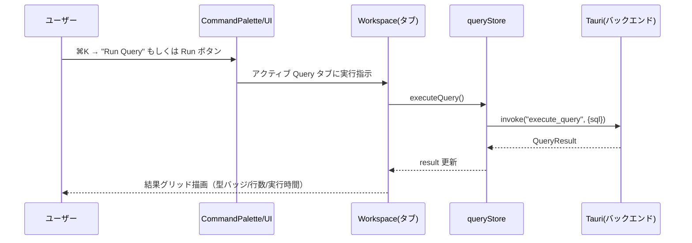
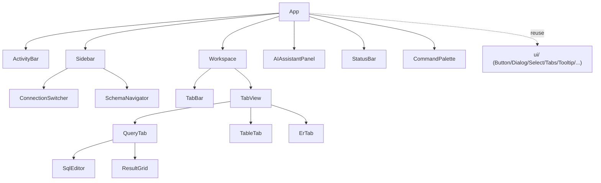

# UI 再構築 設計ドキュメント（TableX Workspace UI）

> 対象: TableX（Tauri v2 + React + Tailwind v4 + Radix/shadcn 風 UI の PostgreSQL 管理デスクトップアプリ）
> 位置づけ: 既存の「TablePlus + shadcn」ベースUI（`docs/design-ui-modernization.md`）の**次世代刷新**。機能は維持し、UI/UX を再構築する。

---

## Overview（概要）

現行の TableX は、Header / Sidebar（スキーマツリー）/ MainPanel（Query・ER図の2タブ）/ StatusBar という単一ワークスペース構成になっている。機能面（接続管理・SQL実行・CRUD編集・AI生成・ER図・履歴・CSV出力）は充実している一方で、UI/UX には以下の伸びしろがある。

- 単一エディタ固定で、複数クエリを並行して扱えない
- グローバルなナビゲーション／コマンド手段（コマンドパレット）がない
- テーマがOSの `prefers-color-scheme` 追従のみで、アプリ内トグルがない
- 情報密度・余白・エレベーション（影/階層）・モーションが設計として体系化されていない
- 空状態 / ローディング / エラー状態の演出が場所によりばらつく

本設計では、既存機能を1つも落とさずに、**「ワークスペース中心のモダンな DB IDE」** へ UI/UX を再構築する。デザイントークンの再定義、レイアウトシステムの刷新、コマンドパレット/マルチタブ/AIアシスタントパネルの導入を柱とする。

### 再構築の柱（サマリ）

| # | 柱 | 概要 |
|---|-----|------|
| 1 | デザインシステム刷新 | トークン（色/間隔/角丸/影/モーション）を再定義し、密度モード（Comfortable/Compact）を導入 |
| 2 | レイアウトシステム | 3ペイン（Activity Bar + Sidebar + Workspace）＋ドッキング可能なボトム/右パネル、レイアウト永続化 |
| 3 | コマンドパレット（⌘K） | 全アクション・接続・テーブルへのキーボード起点アクセス |
| 4 | マルチタブ・クエリワークスペース | クエリ/テーブル/ER図を複数タブで並行操作 |
| 5 | AI アシスタントパネル | 上部バーから、右サイドの対話型アシスタントパネルへ格上げ |
| 6 | 結果グリッド強化 | ヘッダー固定・型バッジ・インラインフィルタ・セル詳細ドロワー |
| 7 | テーマ&アクセシビリティ | ライト/ダーク/システムの明示トグル、フォーカスリング、reduced-motion、コントラスト担保 |

---

## Purpose（目的）

### なぜ再構築が必要か

1. **生産性の頭打ち**: 単一エディタ・単一結果ビューでは、実務（複数クエリの比較、参照しながらの編集）でタブ切替の代替手段がない。
2. **操作の発見性**: 機能は多いが、メニュー/ボタンに散在し、キーボード起点で辿る導線（コマンドパレット）がない。
3. **デザインの一貫性**: 現状はトークンが色中心で、間隔・影・モーション・密度が体系化されておらず、画面ごとに微妙な差異が出ている。
4. **競合との差別化**: TablePlus/DBeaver/pgAdmin に対し、「軽量 × AI ネイティブ × キーボードファースト」を UI として明確に打ち出したい。

### 代替案の検討

| 案 | 内容 | 評価 |
|----|------|------|
| A. 全面刷新（本設計・推奨） | レイアウト/トークン/主要インタラクションを再構築 | UX 効果大。段階導入でリスク管理可 |
| B. 見た目のみ微調整 | 配色と余白の微修正に留める | 低コストだが本質的課題（発見性・並行作業）が残る |
| C. 別UIフレームワークへ移行 | 例: 別コンポーネント基盤へ載せ替え | 移行コスト過大・機能退行リスク。不採用 |

→ 既存資産（Radix/shadcn 風 `ui/`、Zustand ストア、Tauri コマンド）を活かせる **案A** を、**段階的（フェーズ分割）** に実施する。

---

## What to Do（要件）

### 機能要件（FR）— 既存機能は全て維持

| ID | 要件 | 既存 | 再構築での扱い |
|----|------|------|----------------|
| FR-1 | 接続管理（作成/保存/自動接続/切断） | あり | Activity Bar + 接続スイッチャーに再配置 |
| FR-2 | スキーマツリー閲覧（schema/table/column/keys） | あり | 検索・フィルタ・お気に入り追加。仮想スクロール |
| FR-3 | SQL 実行（Monaco） | あり | マルチタブ化。実行/整形/中断 |
| FR-4 | 結果グリッド表示 | あり | ヘッダー固定・型バッジ・列リサイズ維持・セル詳細ドロワー |
| FR-5 | CRUD 編集（セル/行 挿入・削除） | あり | 挙動維持、編集中バッジ・差分ハイライト強化 |
| FR-6 | AI 生成（自然言語→SQL, Claude/Ollama） | あり | 右サイドのアシスタントパネルへ格上げ、生成SQLのエディタ挿入 |
| FR-7 | クエリ履歴 | あり | 履歴をパネル/コマンドパレット両方から |
| FR-8 | ER 図（dagre） | あり | ワークスペースタブの一種として維持、ミニマップ/ズーム |
| FR-9 | CSV エクスポート | あり | 結果ツールバーから維持（将来 JSON/Markdown 拡張余地） |
| FR-10 | キーボードショートカット | あり | コマンドパレットと統合、一覧ダイアログ維持 |
| FR-11 | ステータスバー | あり | 接続/行数/実行時間/密度・テーマ切替を集約 |
| FR-12 | ライト/ダークテーマ | システム追従のみ | **明示トグル（Light/Dark/System）を追加** |

### 非機能要件（NFR）

- **アクセシビリティ**: 既存のスキップリンク/sr-only を継続。全インタラクティブ要素にフォーカスリング、`aria-*`、キーボード操作。`prefers-reduced-motion` 尊重（既存 CSS を踏襲）。
- **パフォーマンス**: 大きな結果セット/長いスキーマツリーは仮想化（レンダリング行数を抑制）。テーマ切替・パネル開閉はレイアウトシフトを最小化。
- **保守性**: デザイントークンを単一の情報源（CSS 変数）に集約。既存の `cn()` / cva パターン・`ui/` プリミティブを再利用。
- **一貫性**: 密度・角丸・影・間隔を token scale に統一（後述）。
- **互換性**: 既存の Zustand ストア API・Tauri コマンド・生成型（`types/generated`）を変更しない（UI層の再構築に限定）。

### レイアウト構成（再構築後）

---

## How to Do It（実装方針）

> 方針: **UI 層のみの再構築**。ストア/バックエンド/生成型には手を入れない。既存 `src/components/ui/` プリミティブと `cn()`/cva を土台に、レイアウトと画面を組み替える。

### 1. デザインシステム（トークン再定義）

現行 `src/App.css` の HSL 変数群を土台に、**間隔・影・モーション・密度**の軸を追加する。

- **カラー**: 既存のセマンティック変数（`--primary` 等）を維持しつつ、`--elevation-*`（影）、`--overlay`（モーダル背景）を追加。
- **スペーシング/密度**: `--density`（`comfortable` / `compact`）に応じて行高・パディングを切替（`data-density` 属性でルートに付与）。
- **角丸/影**: `--radius-*` は継続。`--shadow-sm/md/lg` を新設し、パネル・ポップオーバー・ドロワーで統一。
- **モーション**: `--motion-fast/base`（例 120ms/200ms）と標準イージングを定義。`prefers-reduced-motion` で無効化（既存ルールを踏襲）。

### 2. レイアウトシステム

- `ResizableLayout` を拡張し、**Activity Bar + Sidebar + Workspace + 右AIパネル**の 3〜4 ペイン構成へ。
- ペイン幅/高さ・パネル開閉・密度・テーマの状態を **`localStorage` に永続化**（新規 `uiStore`（Zustand）を追加。既存ストアには非干渉）。
- ボトム（結果）と右（AI）はドッキング開閉可能。

### 3. コマンドパレット（⌘K / Ctrl+K）

- 新規 `CommandPalette` コンポーネント（Radix Dialog ベース、既存 `dialog.tsx` を流用）。
- ソース: アクション（実行/整形/エクスポート/テーマ切替…）、接続一覧、スキーマ内テーブル。
- 既存の `KeyboardShortcutsDialog` と統合（パレットから一覧表示）。

### 4. マルチタブ・ワークスペース

- `uiStore` にタブモデル（`{ id, kind: 'query'|'table'|'er', title, state }`）を保持。
- 既存 `MainPanel` の単一 `activeTab`（query/er）を、複数タブ配列へ一般化。
- 「テーブルを開く＝CRUD タブ」「クエリ＝Query タブ」「ER＝ER タブ」。既存の CRUD モード（`queryStore`）とはアダプタで接続。

### 5. AI アシスタントパネル

- 現行 `AiQueryBar`（上部）を、右ドックの対話パネルへ再配置。生成 SQL は「エディタへ挿入」「そのまま実行」を選択可能に。
- `aiStore` はそのまま利用。

### 6. 結果グリッド強化

- 既存 `ResultGrid`/`QueryResultTable`（TanStack Table）を維持しつつ、ヘッダー sticky・列型バッジ・NULL 表示（`--table-null`）・セル詳細ドロワーを追加。列リサイズ（`useColumnResize`）は継続。

### 主要インタラクション（例: クエリ実行フロー）

### コンポーネント構成（再構築後の主要ツリー）

### 段階導入計画（フェーズ）

| フェーズ | 内容 | 完了条件（検証可能単位） |
|---------|------|--------------------------|
| P0 | デザイントークン再定義（色/間隔/影/モーション/密度） | 既存画面がトークン適用後も破綻せず表示、lint/tsc/test 緑 |
| P1 | レイアウトシステム + `uiStore`（永続化・密度・テーマトグル） | ペイン開閉/幅/テーマが再起動で復元 |
| P2 | コマンドパレット（⌘K） | パレットから主要アクション/接続/テーブルへ到達 |
| P3 | マルチタブ・ワークスペース | 複数 Query/Table/ER タブの並行操作 |
| P4 | AI アシスタントパネル化 + 結果グリッド強化 | AIパネルからの挿入/実行、型バッジ/セル詳細 |

各フェーズは「機能を落とさず、検証可能な単位で承認 → コミット」（リポジトリの `implement` 方針に準拠）。

---

## What We Won't Do（やらないこと）

- **バックエンド（Rust/Tauri コマンド）や DB 対応範囲の変更**（PostgreSQL 前提は据え置き）。
- **Zustand ストアの公開 API・生成型（`types/generated`）の破壊的変更**（UI 層に限定。必要な状態は新規 `uiStore` に隔離）。
- **新しい UI フレームワーク/コンポーネントライブラリへの移行**（既存 Radix/shadcn 風資産を継続）。
- **機能の追加・削除**（あくまで UI/UX 再構築。エクスポート形式追加などは将来課題）。
- **プラグイン/拡張機構・多DB対応・クラウド同期**などの新規大型機能。

---

## Concerns（懸念・決定事項）

### 決定済み（合意）

1. **デザイン方向性**: 現行の TablePlus 風を踏襲・洗練する路線とする（別フレームワーク移行はしない）。
2. **再構築の規模**: **全面刷新**を採用。P0（トークン）〜P4（AIパネル/結果強化）まで、マルチタブ + Activity Bar + コマンドパレット + AIパネル化まで踏み込む。
3. **進め方**: **設計承認 → フェーズ順に実装**。各フェーズは検証可能単位で承認 → コミット（`implement` 方針に準拠）。

### 既定として採用（異議があれば変更）

4. **テーマトグルの既定**: System 既定 + 明示切替（Light/Dark/System）。
5. **アクセシビリティ基準**: WCAG AA を目標（コントラスト比・フォーカス可視・キーボード完全操作）。
6. **マルチタブの状態永続化範囲**: 開いているタブ構成は復元。未実行クエリ本文の復元可否は P3 詳細設計時に確定。

### 留意

7. **検証環境**: 本セッションは Linux。Tauri ネイティブ WebView の確認は限定的なため、UI は Vite dev（ブラウザ）中心で検証し、要所のみ実機確認する。既存の lint / tsc / vitest を各フェーズの回帰チェックに用いる。

---

## Reference Materials/Information（参考情報）

- 既存設計: `docs/DESIGN.md`（全体設計）、`docs/design-ui-modernization.md`（TablePlus + shadcn 化）、`docs/design/ui-ux-improvements.md`、`docs/design-crud-operations.md`
- 既存実装: `src/App.tsx` / `src/App.css`（トークン）/ `src/components/layout/*` / `src/components/{editor,result,schema,er-diagram,ai,ui}/*`
- 状態管理: `src/store/{connectionStore,queryStore,schemaStore,aiStore}.ts`
- UI 基盤: `src/components/ui/*`（Radix + cva + `cn()`）、`lucide-react`、`@monaco-editor/react`、`@dagrejs/dagre`
