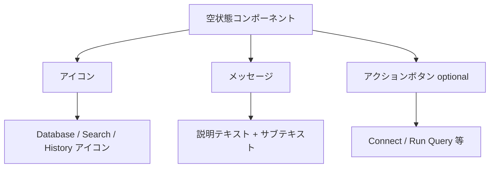

# Overview

tablex (DB Pilot) のUI/UXを全面的に改善する。アクセシビリティの根本的な問題の修正、デザイン面の改善（ER図レイアウト、Historyパネルの視認性向上、空状態の改善等）、および体感パフォーマンスの向上（スケルトンスクリーン導入）を行う。

## Purpose

現状のUIには以下の課題がある：

1. **アクセシビリティの欠如**: `aria-live` なし、スキップリンクなし、`prefers-reduced-motion` 未対応など、WCAG準拠に必要な基本要素が不足している
2. **デザインの使いにくさ**: ER図が縦長で画面の横長レイアウトと合わない、Historyパネルが狭くて見切れる、空状態がテキストのみ
3. **体感パフォーマンスの低さ**: ローディング時にテキスト表示のみで、スケルトンスクリーンがない
4. **セマンティックHTMLの不備**: クリック可能な `<span>/<div>` が `<button>` でない、フォームラベルの紐付け不足

これらを修正し、プロフェッショナルなデスクトップDBツールとしての品質に引き上げる。

## What to Do

### Phase 1: アクセシビリティ（CRITICAL/HIGH）

| # | 要件 | 対象ファイル |
|---|------|------------|
| 1-1 | エラーメッセージに `aria-live="polite"` または `role="alert"` を追加 | AiQueryBar, ResultGrid, ConnectionDialog |
| 1-2 | `outline-none` のみの箇所にフォーカスリング（`focus-visible:ring-2`）を追加 | AiSettingsDialog, EditableCell, select, dropdown-menu |
| 1-3 | クリック可能な `<span>` を `<button>` に置き換え | SchemaTree (expand icon) |
| 1-4 | `prefers-reduced-motion` 対応を App.css にグローバル追加 | App.css |
| 1-5 | スキップリンク追加 | App.tsx |
| 1-6 | 見出し階層の整備（h1追加、ダイアログタイトルの適切な使用） | App.tsx, dialogs |
| 1-7 | フォームラベルの `htmlFor`/`id` 紐付け | AiSettingsDialog, ConnectionDialog, InsertRowDialog |
| 1-8 | 必須フィールドに `required` 属性とアスタリスク表示 | ConnectionDialog, InsertRowDialog |
| 1-9 | エラーメッセージの `aria-describedby` 追加 | フォーム全般 |

### Phase 2: デザイン改善

| # | 要件 | 対象ファイル |
|---|------|------------|
| 2-1 | ER図を横長レイアウト（LR）に変更 | ErDiagram.tsx |
| 2-2 | ER図にMiniMap追加 | ErDiagram.tsx |
| 2-3 | Historyパネルのレイアウト改善（折りたたみ可能、幅拡大） | MainPanel.tsx, QueryHistory.tsx |
| 2-4 | 空状態にアイコン+アクションボタンを追加 | ResultGrid, SchemaTree, QueryHistory |
| 2-5 | ハードコードされた色をCSS変数に置き換え | ErDiagram, TableNode, AiSettingsDialog, EditableCell |
| 2-6 | サイドバーにテーブル検索/フィルタ機能を追加 | SchemaTree.tsx |
| 2-7 | ダブルクリック操作のヒント追加（ツールチップ or テキスト） | EditableCell, SchemaTree |

### Phase 3: 体感パフォーマンス・UX

| # | 要件 | 対象ファイル |
|---|------|------------|
| 3-1 | スケルトンスクリーンの導入 | ResultGrid, SchemaTree |
| 3-2 | キーボードショートカットヘルプの追加 | 新規コンポーネント |

## How to Do It

### Phase 1 実装詳細

#### 1-1: aria-live の追加

```tsx
// Before
<div className="text-destructive">{error}</div>

// After
<div role="alert" aria-live="polite" className="text-destructive">{error}</div>
```

対象箇所：
- `AiQueryBar.tsx` のエラー表示部分
- `ResultGrid.tsx` のエラー表示部分
- `ConnectionDialog.tsx` のエラー/成功メッセージ部分

#### 1-2: フォーカスリングの修正

`outline-none` を `focus-visible:outline-none` に変更し、`focus-visible:ring-2 focus-visible:ring-ring` を追加する。既にRadix UIコンポーネント（dialog, select等）は適切なフォーカススタイルを持つものが多いが、カスタム入力フィールドに不足がある。

対象箇所：
- `AiSettingsDialog.tsx` の `<input>` / `<select>` 要素
- `EditableCell.tsx` の編集モードの入力要素

#### 1-3: セマンティックHTMLの修正

`SchemaTree.tsx:149` の expand アイコン：
```tsx
// Before
<span onClick={handleExpandClick} className="cursor-pointer">
  <ChevronRight ... />
</span>

// After
<button
  onClick={handleExpandClick}
  aria-label={isExpanded ? "Collapse" : "Expand"}
  className="p-0 bg-transparent border-none cursor-pointer"
>
  <ChevronRight ... />
</button>
```

#### 1-4: prefers-reduced-motion 対応

App.css にグローバルルールを追加：
```css
@media (prefers-reduced-motion: reduce) {
  *,
  *::before,
  *::after {
    animation-duration: 0.01ms !important;
    animation-iteration-count: 1 !important;
    transition-duration: 0.01ms !important;
    scroll-behavior: auto !important;
  }
}
```

#### 1-5: スキップリンク

App.tsx の先頭に追加：
```tsx
<a href="#main-content" className="sr-only focus:not-sr-only focus:absolute focus:z-50 ...">
  Skip to main content
</a>
```
MainPanel に `id="main-content"` を付与。

#### 1-6: 見出し階層

- App.tsx に `<h1 className="sr-only">tablex - Database IDE</h1>` を追加（視覚的には非表示）
- ダイアログのタイトルは Radix UI の `DialogTitle` を使用（既に適切な role を持つ）

### Phase 2 実装詳細

#### 2-1: ER図のレイアウト

**決定事項**: `rankdir: "LR"` は既に設定済み。テーブル数が多いと dagre が自動的に複数段配置するのは避けられないため、レイアウトパラメータの大幅変更は行わない。代わりにMiniMap追加で全体把握を改善する。

#### 2-2: ER図にMiniMap追加

```tsx
import { MiniMap } from "@xyflow/react";

// ReactFlow 内に追加
<MiniMap
  nodeColor={(node) => node.data?.isFocused ? "hsl(var(--primary))" : "hsl(var(--muted-foreground))"}
  maskColor="rgba(0, 0, 0, 0.2)"
  style={{ border: "1px solid hsl(var(--border))" }}
/>
```

#### 2-3: Historyパネルの改善

現状の問題：
- 固定幅 `w-2/5` で狭い
- クエリテキストが `truncate` で1行に切り詰められる
- パネルの存在感が薄い

改善案：

```
変更前:
┌──────────────────────┬──────────────┐
│     AI Query Bar     │   History    │
│     (w-3/5)          │   (w-2/5)   │
└──────────────────────┴──────────────┘

変更後:
┌────────────────────────────────┬───┐
│         AI Query Bar          │ H │  ← トグルボタンで開閉
│                               │ i │
└───────────────────────────────┤ s │
                                │ t │  ← 開くと幅300pxのパネル表示
                                │ . │
                                └───┘
```

**決定事項**: オーバーレイ方式を採用。開くとメインコンテンツに重なる形で幅300pxのパネルが表示される。閉じればフル幅に戻る。

- Historyを右サイドパネルとして独立させる（オーバーレイ）
- デフォルトは閉じた状態（アイコン+バッジのみ）
- クリックで開くと幅300pxのパネルがオーバーレイ表示
- AI Query Barは全幅を使用できる
- クエリテキストは2-3行まで表示（truncateを緩和）

#### 2-4: 空状態の改善



汎用 EmptyState コンポーネントを作成：
```tsx
// src/components/ui/empty-state.tsx
interface EmptyStateProps {
  icon: React.ReactNode;
  title: string;
  description?: string;
  action?: { label: string; onClick: () => void };
}
```

適用箇所：
- `SchemaTree`: Database アイコン + "Connect to a database to view schema"
- `ResultGrid`: Play アイコン + "Run a query to see results" + "Run Query" ボタン
- `QueryHistory`: History アイコン + "No queries yet" + "Queries will appear here after execution"

#### 2-5: ハードコードされた色の置き換え

App.css にER図用のCSS変数を追加：
```css
:root {
  --er-edge: 217 91% 60%;
  --er-bg-dot: 220 13% 91%;
}
.dark {
  --er-edge: 217 91% 67%;
  --er-bg-dot: 216 34% 25%;
}
```

ErDiagram.tsx / TableNode.tsx のハードコード色を `hsl(var(--er-edge))` 等に置き換え。

AiSettingsDialog.tsx / EditableCell.tsx の `border-gray-300` 等は、既存の `--border` / `--input` / `--ring` 変数を使用するように統一。

#### 2-6: サイドバー検索

SchemaTree の先頭にフィルタ入力を追加：
```tsx
const [filter, setFilter] = useState("");
const filteredSchemas = useMemo(() => {
  if (!filter) return schemas;
  return schemas.map(s => ({
    ...s,
    tables: s.tables.filter(t => 
      t.name.toLowerCase().includes(filter.toLowerCase())
    )
  })).filter(s => s.tables.length > 0);
}, [schemas, filter]);
```

UI は `<input>` に検索アイコンを付けたシンプルなフィルタバー。

#### 2-7: ダブルクリックのヒント

- SchemaTree のテーブルノード: 既存の `title="Click to focus in ER diagram"` を `title="Click to focus in ER diagram. Double-click to open table."` に更新
- EditableCell: 非編集モードのセルに `title="Double-click to edit"` を追加

### Phase 3 実装詳細

#### 3-1: スケルトンスクリーン

```tsx
// src/components/ui/skeleton.tsx
export function Skeleton({ className }: { className?: string }) {
  return (
    <div className={cn("animate-pulse rounded-md bg-[hsl(var(--muted))]", className)} />
  );
}
```

SchemaTree 用:
```tsx
function SchemaTreeSkeleton() {
  return (
    <div className="p-2 space-y-2">
      {Array.from({ length: 5 }).map((_, i) => (
        <div key={i} className="flex items-center gap-2 px-2 py-1">
          <Skeleton className="h-3.5 w-3.5 rounded" />
          <Skeleton className="h-4 w-4 rounded" />
          <Skeleton className="h-4 flex-1" />
        </div>
      ))}
    </div>
  );
}
```

ResultGrid 用:
```tsx
function ResultSkeleton() {
  return (
    <div className="p-4 space-y-3">
      <div className="flex gap-4">
        {Array.from({ length: 4 }).map((_, i) => (
          <Skeleton key={i} className="h-8 flex-1" />
        ))}
      </div>
      {Array.from({ length: 5 }).map((_, i) => (
        <div key={i} className="flex gap-4">
          {Array.from({ length: 4 }).map((_, j) => (
            <Skeleton key={j} className="h-6 flex-1" />
          ))}
        </div>
      ))}
    </div>
  );
}
```

#### 3-2: キーボードショートカットヘルプ

ヘッダーの設定アイコンの隣にキーボードアイコンを追加。クリックでショートカット一覧のダイアログを表示。

| ショートカット | 機能 |
|-------------|------|
| `Cmd/Ctrl + Enter` | AI クエリ生成 |
| `Enter` (セル編集中) | 保存 |
| `Escape` (セル編集中) | キャンセル |
| `?` | ショートカットヘルプ表示 |

## What We Won't Do

- **レスポンシブ対応**: デスクトップアプリ（Tauri）のため、モバイル対応は行わない
- **ダークモードの色の全面見直し**: 現状のHSLベースの色システムは良好。ER図等の個別ハードコードのみ修正
- **国際化(i18n)**: 現時点では英語UIのままとする
- **アニメーションの大幅追加**: `prefers-reduced-motion` 対応を優先し、新規アニメーションは最小限
- **ヘッダー接続情報の拡充**: 接続先ホスト名の表示は別Issue扱い

## Alternatives Considered

### Historyパネルの改善案

**案A: 下部パネル（採用しない）**
- Historyをエディタ/結果の下に配置
- 不採用理由: 縦方向のスペースがさらに圧迫される。クエリエディタと結果テーブルの表示領域が狭くなる

**案B: 左サイドバーに統合（採用しない）**
- SchemaTreeの下にHistoryタブを追加
- 不採用理由: スキーマとクエリ履歴は関心が異なる。サイドバーが複雑になる

**案C: 右サイドパネル（トグル式）（採用）**
- デフォルト閉じ、ボタンで開閉
- 採用理由: AI Query Barが全幅を使える。必要な時だけ開く。クエリテキストの表示領域が広がる

### 空状態のデザイン

**案A: イラスト付き（採用しない）**
- 手描き風イラストを表示
- 不採用理由: アセット管理のコスト、デスクトップIDEの雰囲気に合わない

**案B: アイコン+テキスト+アクションボタン（採用）**
- Lucide アイコン + 説明テキスト + オプションのアクションボタン
- 採用理由: 軽量、既存のアイコンセットと統一感がある

## Concerns

1. **ER図のレイアウト調整**: dagre のパラメータ調整だけでは、テーブル数が多い場合に完全に横長にならない可能性がある。`fitView` と組み合わせた実際の表示確認が必要
2. **Historyパネルの位置変更**: 既存ユーザーの操作フローが変わる。トグルボタンの位置を目立たせる工夫が必要
3. **スケルトンスクリーン**: ローディング時間が短い場合（<300ms）にスケルトンがチラつく可能性。最小表示時間の設定を検討
4. **Phase間の依存**: Phase 1（アクセシビリティ）は他のPhaseに依存しないため先行実装可能。Phase 2-3は一部ファイルが重複するため、マージ順序に注意

## Reference Materials/Information

- [WCAG 2.1 Guidelines](https://www.w3.org/TR/WCAG21/)
- [Radix UI Accessibility](https://www.radix-ui.com/docs/primitives/overview/accessibility)
- [dagre Wiki - Configuring the Layout](https://github.com/dagrejs/dagre/wiki#configuring-the-layout)
- [@xyflow/react MiniMap](https://reactflow.dev/api-reference/components/minimap)
- UI/UX Pro Max スキル — Quick Reference §1-§8
